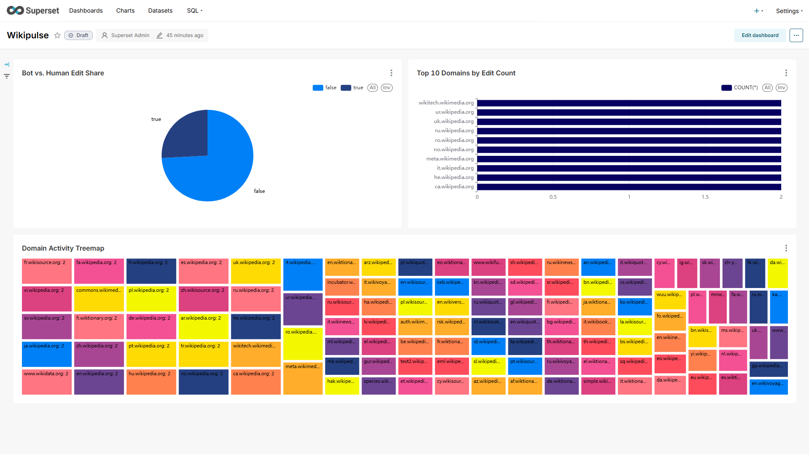

# **WikiPulse \- Real-Time Wikipedia Edit Analytics Platform**

WikiPulse is a complete, end-to-end data engineering pipeline that ingests, processes, and visualizes the real-time stream of Wikipedia edits. This project demonstrates a modern, scalable tech stack, with all services fully containerized using Docker and automated for easy startup.

## **📊 Final Dashboard**

The final output is a live dashboard built in Apache Superset that provides real-time insights into global Wikipedia edit activity.

### **The dashboard features three main charts:**

* **Domain Activity Treemap:** Visualizes the distribution of edits across all Wikipedia domains. Larger rectangles indicate higher edit volumes, providing a quick overview of which language wikis are most active.  
* **Bot vs. Human Edit Share:** A pie chart that shows the percentage of total edits made by automated bots compared to human editors.  
* **Top 10 Domains by Edit Count:** A bar chart that highlights the 10 most active Wikipedia domains by total number of edits.

## **🛠️ Tech Stack**

* **Data Ingestion**: Python (requests, sseclient-py)  
* **Message Broker**: Apache Kafka  
* **Stream Processing**: Apache Spark (PySpark)  
* **Database**: PostgreSQL  
* **BI & Visualization**: Apache Superset  
* **Containerization**: Docker & Docker Compose  
* **Automation**: PowerShell

## **🚀 How to Run**

1. **Prerequisites:**  
   * Docker Desktop installed and running.  
   * Python installed on your local machine.  
2. **Clone the repository:**  
   git clone \[https://github.com/YOUR\_USERNAME/wikipulse-project.git\](https://github.com/YOUR\_USERNAME/wikipulse-project.git)  
   cd wikipulse-project

3. **Install Python dependencies for the producer:**  
   pip install kafka-python sseclient-py requests

4. Run the automated startup script:  
   This script will start all Docker containers, initialize Superset, launch the producer, and submit the Spark job.  
   PowerShell \-ExecutionPolicy Bypass \-File .\\start-pipeline.ps1

5. **Access the Dashboard:**  
   * Wait a few minutes for all services to initialize.  
   * Open your browser and navigate to http://localhost:8088.  
   * Log in with username admin and password admin.  
   * The Wikipedia Edit Monitor dashboard should be available.

## **🛑 How to Stop**

To shut down all services, run the stop script:

PowerShell \-ExecutionPolicy Bypass \-File .\\stop-pipeline.ps1  
